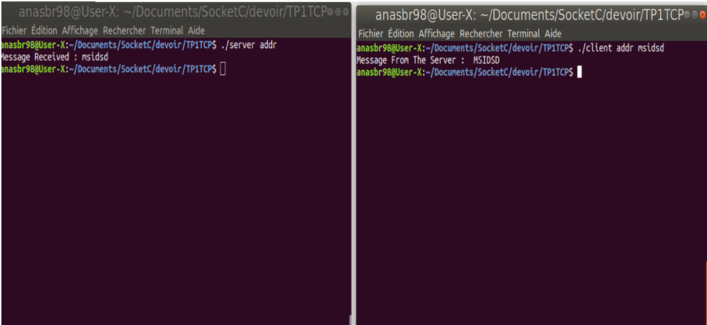
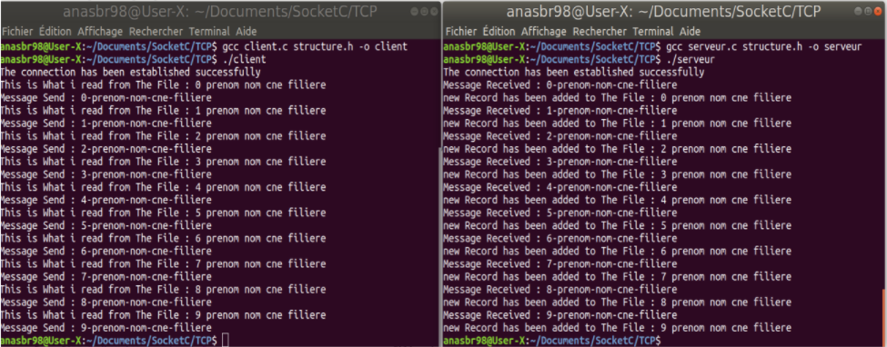
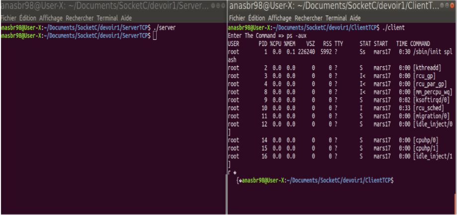
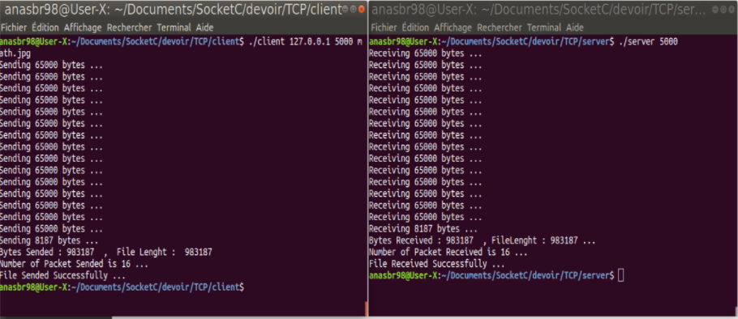

# Socket in C
This Repository contains some examples of socket in C implemented in Linux Operating System .

## Example 1 : 

The client send a lowercase Text to the server using Unix Domain Socket, then the server convert the text to uppercase and send the result .

#### Client :

```c
#include <sys/socket.h>
#include <sys/un.h>
#include <stdio.h>
#include <stdlib.h>
#include <unistd.h>
#include<string.h>

int main(int argc, char** argv) {
  if(argc<2)
  {
      fprintf(stderr,"Not Enough Parameters ...\n");
      exit(EXIT_FAILURE);
  }
  struct sockaddr_un SocketAddress;
  int socketDescripteur,rc;

  if ( (socketDescripteur = socket(AF_UNIX, SOCK_STREAM, 0)) == -1) {
      fprintf(stderr,"Failed to create The Socket ...\n");
      exit(EXIT_FAILURE);
  }

  memset(&SocketAddress, 0, sizeof(SocketAddress));
  bcopy(argv[1],SocketAddress.sun_path,sizeof(argv[1]));
  SocketAddress.sun_family = AF_UNIX;

  if (connect(socketDescripteur, (struct sockaddr*)&SocketAddress, sizeof(SocketAddress)) == -1) {
      fprintf(stderr,"Failed to Connect To The Server ...\n");
      exit(EXIT_FAILURE);
  }

  if(send(socketDescripteur,argv[2],sizeof(argv[2]),0) == -1)
  {
      fprintf(stderr,"Failed to Send The Message ...\n");
      exit(EXIT_FAILURE);
  }  

  if(recv(socketDescripteur,argv[2],sizeof(argv[2]),0) == -1)
  {
      fprintf(stderr,"Failed to Receive The Message ...\n");
      exit(EXIT_FAILURE);
  }  
   
   printf("Message From The Server :  %s \n",argv[2]);
   close(socketDescripteur);

  return 0;
}
```

### Server :

```c
#include <stdio.h>
#include <unistd.h>
#include <sys/socket.h>
#include <sys/un.h>
#include <stdlib.h>
#include<string.h>
void toUpperCase(char* ch)
{
    char *p;
    for(p=ch;*p!='\0';p++)
    {
        if(*p >= 'a' && *p <= 'z')
        {
            *p = *p -32;
        }
    }
}

int main(int argc, char** argv) {
  if(argc < 1)
  {
      fprintf(stderr,"Not Enough Parameters ...\n");
      exit(EXIT_FAILURE);
  }
  
  struct sockaddr_un SocketAddress;
  int socketDescripteur,clientDescripteur;
  char message[20];

  if ( (socketDescripteur = socket(AF_UNIX, SOCK_STREAM, 0)) == -1) {
    fprintf(stderr,"Failed Create The Socket ...\n");
    exit(EXIT_FAILURE);
  }

  memset(&SocketAddress, 0, sizeof(SocketAddress));
  SocketAddress.sun_family = AF_UNIX;
  bcopy(argv[1],SocketAddress.sun_path,sizeof(argv[1]));
  
  if (bind(socketDescripteur, (struct sockaddr*)&SocketAddress, sizeof(SocketAddress)) == -1) {
    fprintf(stderr,"Failed To Bind ...\n");
    exit(EXIT_FAILURE);
  }

  if (listen(socketDescripteur, 5) == -1) {
    fprintf(stderr,"Failed To listen ...\n");
    exit(EXIT_FAILURE);
  }

  if ( (clientDescripteur = accept(socketDescripteur, NULL, NULL)) == -1) {
      fprintf(stderr,"Failed To accept a new Client ...\n");
      exit(EXIT_FAILURE);
    }

  if(recv(clientDescripteur,message,sizeof(message),0) == -1)
  {
     fprintf(stderr,"Failed To Receive The Message ...\n");
      exit(EXIT_FAILURE);
  }

  printf("Message Received : %s \n",message);
  toUpperCase(message);

  if(send(clientDescripteur,message,sizeof(message),0) == -1)
  {
    fprintf(stderr,"Failed To Send The Message ...\n");
      exit(EXIT_FAILURE);
  }
  close(socketDescripteur);
  close(clientDescripteur);
  return 0;
}
```

#### Result :

<div align="center" >

</div>

## Example 2 : 

The Client Read a list of records of type Etudiant (Student)
to The Server , then The server receive the data a write it to a file .

Struct Etudiant is defined as bellow :

```c
#ifndef __structure


typedef struct Etudiant
{
	int numero;    // Number
	char prenom[10];  // first name
	char nom[10];   // last name
	char cne[15];   // The student number 
	char filiere[10]; // speciality
}Etudiant;


#endif


```

#### Client (TCP) : 

```c
#include<stdio.h>
#include<stdlib.h>
#include<sys/types.h>
#include<sys/socket.h>
#include<sys/un.h>
#include<string.h>
#include<unistd.h>
#include "structure.h"

void getString(char* result ,Etudiant e)
{
sprintf(result,"%d-%s-%s-%s-%s",e.numero,e.prenom,e.nom,e.cne,e.filiere);
}

int main(int argc, char **argv)
{
	
	int SocketDescripteur;
	Etudiant e;	
	FILE *PF;
	char messageToSend[100];
	
	struct sockaddr_un serverAddress;
	bzero((char*)&serverAddress,sizeof(serverAddress));
	serverAddress.sun_family = AF_UNIX;
	bcopy("unix_socket",serverAddress.sun_path,11);	
	if((SocketDescripteur  = socket(AF_UNIX,SOCK_STREAM,0)) == -1)
	{
		perror("Failed to create Socket ...\n");
		exit(EXIT_FAILURE);
	}
	
	if(connect(SocketDescripteur,(struct sockaddr*)&serverAddress,sizeof(serverAddress)) == -1)
	{
	perror("Failed to Connect ...\n");
	exit(EXIT_FAILURE);
	}
	printf("The connection has been established successfully \n");

	PF = fopen("file1.txt","r");
	if(PF == NULL)
	{
		perror("Failed to Open The file");
		exit(EXIT_FAILURE);
	}

	while(!feof(PF))
	{		
	fscanf(PF,"%d\t%s\t%s\t%s\t%s\n",&e.numero,e.prenom,e.nom,e.cne,e.filiere);
	printf("This is What i read from The File : %d %s %s %s %s\n",e.numero,e.prenom,e.nom,e.cne,e.filiere);
	getString(messageToSend,e);
	printf("Message Send : %s \n",messageToSend);	
	write(SocketDescripteur,messageToSend,sizeof(messageToSend));
	}
	fclose(PF);
	close(SocketDescripteur);		

	return EXIT_SUCCESS;
}


```


#### Server (TCP) : 

```c

#include<stdio.h>
#include<stdlib.h>
#include<sys/types.h>
#include<sys/socket.h>
#include<sys/un.h>
#include<string.h>
#include<unistd.h>
#include "structure.h"

void getEtudiant(char *str,Etudiant *e)
{
	int i=0;
	const char *delimiteur = "-"; 
	char* token; 
	  
    token = strtok(str, delimiteur); 
  
    while (token != 0) { 
       	switch (i)
	{
	case 0 :
		e->numero = atoi(token);
		break;
	case 1 :
		strcpy(e->prenom,token);
		break;
	case 2 :
		strcpy(e->nom,token);
		break;
	case 3 :
		strcpy(e->cne,token);
		break;
	case 4 :
		strcpy(e->filiere,token);
		break;
	}
	i++; 
        token = strtok(0, delimiteur); 
    }	
}


int main(int argc, char **argv){
	
	//déclaration des variables
	int ServerDescipteur,ClientDescripteur,longSocketClient;
	char messageReceived[100];
	Etudiant e;
	FILE *PF;
	struct sockaddr_un AddressServer,AddressClient;
	bzero((char*)&AddressServer,sizeof(AddressServer));	
	AddressServer.sun_family = AF_UNIX;
	bcopy("unix_socket",AddressServer.sun_path,11);
	if((ServerDescipteur = socket(AF_UNIX,SOCK_STREAM,0)) == -1)
	{
	perror("Failed to Create Socket ... \n");
	exit(EXIT_FAILURE);
	}
	if(bind(ServerDescipteur,(struct sockaddr*)&AddressServer,sizeof(AddressServer)) == -1)
	{
		perror("Failed to Bind ... \n");
		exit(EXIT_FAILURE);
	}
	if(listen(ServerDescipteur,5) == -1)
	{
	perror("Failed to listen ... \n");
	exit(EXIT_FAILURE);
	}
	longSocketClient = sizeof(AddressClient);
	if((ClientDescripteur = accept(ServerDescipteur,(struct sockaddr *)&AddressClient,&longSocketClient)) == -1)
	{
		perror("Failed to connect to client ... \n");
		exit(EXIT_FAILURE);
	}
	printf("The connection has been established successfully \n");	
	PF = fopen("file2.txt","w");
	if(PF == NULL)
	{
		perror("Failed to Open The file");
		exit(EXIT_FAILURE);
	}
	while(read(ClientDescripteur ,messageReceived,sizeof(messageReceived))>0)
	{	
	printf("Message Received : %s \n",messageReceived);
	getEtudiant(messageReceived,&e);	
	printf("new Record has been added to The File : %d %s %s %s %s\n",e.numero,e.prenom,e.nom,e.cne,e.filiere);
	fprintf(PF,"%d\t%s\t%s\t%s\t%s\n",e.numero,e.prenom,e.nom,e.cne,e.filiere);
	}

	close(ServerDescipteur);
	close(ClientDescripteur);
	fclose(PF);
	unlink("unix_socket");
	
	return EXIT_SUCCESS;
}

```

There is a version in UDP also .

#### Result :

<div align="center" >

</div>

## Example 3 : 

The Client send a command to the server to execute , The Server receive the command then he execute it and send back the result to The Client .

#### Client : 

```c

#include <sys/socket.h>
#include <sys/types.h>
#include <netinet/in.h>
#include <netdb.h>
#include <stdio.h>
#include <string.h>
#include <stdlib.h>
#include <unistd.h>
#include <errno.h>
#include <arpa/inet.h>
 
int main(void)
{
  int sockdescripteur = 0;
  char receivedMessage[1024],messageToSend[100];
  struct sockaddr_in serv_addr;
 
  memset(receivedMessage, '0' ,sizeof(receivedMessage));
  memset(messageToSend,'0',sizeof(messageToSend));
  if((sockdescripteur = socket(AF_INET, SOCK_STREAM, 0))< 0)
  {
      perror("Failed to create The Socket ...\n");
      exit(EXIT_FAILURE);
  }
 
  serv_addr.sin_family = AF_INET;
  serv_addr.sin_port = htons(5000);
  serv_addr.sin_addr.s_addr = inet_addr("127.0.0.1");
 
  if(connect(sockdescripteur, (struct sockaddr *)&serv_addr, sizeof(serv_addr))<0)
    {
      perror("Connection Failed ...\n");
      exit(EXIT_FAILURE);
    }
      printf("Enter The Command => ");
      gets(messageToSend);
      if(send(sockdescripteur,messageToSend,sizeof(messageToSend),0) == -1)
      {
        perror("Failed to send the command ...\n");
        exit(EXIT_FAILURE);
      }

      if(recv(sockdescripteur,receivedMessage,sizeof(receivedMessage),0) == -1)
      {
        perror("Failed to receive the result  ...\n");
        exit(EXIT_FAILURE);
      }
      printf("%s",receivedMessage);
 
  return 0;
}

```


### Server :

```c
#include <sys/socket.h>
#include <netinet/in.h>
#include <arpa/inet.h>
#include <stdio.h>
#include <stdlib.h>
#include <unistd.h>
#include <errno.h>
#include <string.h>
#include <sys/types.h>
#include<wait.h>
    int main(void)
    {
      int SocketDescripteur = 0,ClientSocket = 0;
      
      struct sockaddr_in ServerAdd;
    
      char sendBuff[1025],receiveBuff[1025];  
      int numrv;  
    
      SocketDescripteur = socket(AF_INET, SOCK_STREAM, 0);      
      memset(&ServerAdd, '0', sizeof(ServerAdd));
      memset(sendBuff, '0', sizeof(sendBuff));
      memset(receiveBuff,'0',sizeof(receiveBuff));    
      ServerAdd.sin_family = AF_INET;    
      ServerAdd.sin_addr.s_addr = htonl(INADDR_ANY); 
      ServerAdd.sin_port = htons(5000);    
    
      bind(SocketDescripteur, (struct sockaddr*)&ServerAdd,sizeof(ServerAdd));
      
      if(listen(SocketDescripteur, 10) == -1){
          perror("Failed to listen ... \n");
          exit(EXIT_FAILURE);
      }     
      
      ClientSocket = accept(SocketDescripteur, (struct sockaddr*)NULL ,NULL);
  
      if(recv(ClientSocket,receiveBuff,sizeof(receiveBuff),0) == -1)
      {
          perror("Failed to recive ...\n");
          exit(EXIT_FAILURE);
      }
      if(fork()==0)
      {
          int count = 0;
      char *ptr = receiveBuff;
      while((ptr = strchr(ptr, ' ')) != NULL) {
          count++;
          ptr++;
      }
      char *argv[count+2];
      const char *delimiter = " ";
      char *token;
      token = strtok(receiveBuff,delimiter);
      int i=0;
      while(token != 0)
      {
        argv[i] = malloc(sizeof(token)+1);	
        strcpy(argv[i],token);
        i++;
        token = strtok(0,receiveBuff);
      }
      argv[i] = NULL;
      dup2(ClientSocket,STDOUT_FILENO);
      execvp(argv[0],argv);
      }
      wait(NULL);
      close(ClientSocket);    

  return 0;
}


```
#### Result :

<div align="center" >

</div>

#### Example 4:

The Client sends a file To the server, the file can be a simple text, video, audio file (In Linux everything is a file) ... 

#### Client :

```c 
#include<stdio.h>
#include<stdlib.h>
#include<string.h>
#include<sys/types.h>
#include<sys/socket.h>
#include<arpa/inet.h>
#include<unistd.h>


int main(int argc,char** argv)
{
    if(argc < 3)
    {
        fprintf(stderr,"Not Enough Parameters ...\n");
        exit(EXIT_FAILURE);
    }
    
    int serverSocketDescripteur,structLen,result,BytesSended=0,FileLenght,SIZEMAX = 65000,PacketNumber=0;
    struct sockaddr_in clientSocket;
    char FileInfos[20],*buffer;
    FILE *file;

    memset(&clientSocket,'0',sizeof(clientSocket));

    clientSocket.sin_family = AF_INET;
    clientSocket.sin_port = htons(atoi(argv[2]));
    clientSocket.sin_addr.s_addr = inet_addr(argv[1]);

    if((serverSocketDescripteur = socket(AF_INET,SOCK_STREAM,0)) == -1)
    {
        fprintf(stderr,"Failed to Create the Socket ...\n");
        exit(EXIT_FAILURE);
    }

    if(connect(serverSocketDescripteur, (struct sockaddr *)&clientSocket,sizeof(clientSocket)) == -1)
    {
        fprintf(stderr,"Failed to Connect to The Server ...\n");
        exit(EXIT_FAILURE);
    }

    if((file = fopen(argv[3],"r")) == NULL)
    {
        fprintf(stderr,"Failed to Open The File ...\n");
        exit(EXIT_FAILURE);
    }
    fseek(file,0,SEEK_END);
    FileLenght = ftell(file);
    fseek(file,0,SEEK_SET);
    buffer = (char*)malloc(SIZEMAX * sizeof(char));
    sprintf(FileInfos,"%s@%d",argv[3],FileLenght);
    
    if(send(serverSocketDescripteur,FileInfos,sizeof(FileInfos),0) == 0)
    {
        fprintf(stderr,"Failed to Send The File Infos To The Server ...\n");
        exit(EXIT_FAILURE);
    }

    while(BytesSended < FileLenght)
    {
        if(FileLenght-BytesSended < SIZEMAX)
        {
            SIZEMAX = FileLenght-BytesSended;
            buffer = realloc(buffer,SIZEMAX);
        }

        if((result = fread(buffer,1,SIZEMAX,file)) == -1)
        {
            fprintf(stderr,"Failed to Read From The File ...\n");
            exit(EXIT_FAILURE);
        }

        if((result = send(serverSocketDescripteur,buffer,SIZEMAX,0)) == -1)
        {
            fprintf(stderr,"Failed to send Data to Server ...\n");
            exit(EXIT_FAILURE);
        }

        printf("Sending %d bytes ...\n",result);
        BytesSended += result;
        PacketNumber++;
    }
    printf("Bytes Sended : %d  ,  File Lenght :  %d \n",BytesSended,FileLenght);
    printf("Number of Packet Sended is %d ...\n",PacketNumber);
    printf("File Sended Successfully ...\n");
    close(serverSocketDescripteur);
    close(serverSocketDescripteur);
    fclose(file);
    return 0;
}

```

#### Server :

```c 
#include<stdio.h>
#include<stdlib.h>
#include<string.h>
#include<sys/stat.h>
#include<sys/types.h>
#include<sys/socket.h>
#include<arpa/inet.h>
#include<unistd.h>

void getFileInfos(char* message,char* fileN,int *fileL)
{
    char *token = strtok(message,"@");
    strcpy(fileN,token);
    token = strtok(0,"@");
    *fileL = atoi(token);
}


int main(int argc,char** argv)
{
     if(argc < 1)
    {
        fprintf(stderr,"Not Enough Parameters ...\n");
        exit(EXIT_FAILURE);
    }
    int socketDescripteur,clientSocketDescripteur,result,BytesReceived=0,structlen,FileLenght,SIZEMAX = 65000,PacketNumber=0;
    struct sockaddr_in serverSocket;
    char FileInfos[20],FileName[10],Path[10],*buffer;
    FILE *file;

    memset(&serverSocket,'0',sizeof(serverSocket));

    serverSocket.sin_family = AF_INET;
    serverSocket.sin_port = htons(atoi(argv[1]));
    serverSocket.sin_addr.s_addr = htonl(INADDR_ANY);

    if((socketDescripteur = socket(AF_INET,SOCK_STREAM,0)) == -1)
    {
        fprintf(stderr,"Failed to create The Socket ...\n");
        exit(EXIT_FAILURE);
    }

    if(bind(socketDescripteur,(struct sockaddr*)&serverSocket,sizeof(serverSocket)) == -1)
    {
        fprintf(stderr,"Failed to Bind ...\n");
        exit(EXIT_FAILURE);
    }
    
    if(listen(socketDescripteur,10) == -1)
    {
        fprintf(stderr,"Failed to listen ...\n");
        exit(EXIT_FAILURE);
    }
    
    if((clientSocketDescripteur = accept(socketDescripteur,(struct sockaddr*)NULL,NULL)) == -1)
    {
        fprintf(stderr,"Failed to accept a new Client ...\n");
        exit(EXIT_FAILURE);
    }

   if(recv(clientSocketDescripteur,FileInfos,sizeof(FileInfos),0) == -1)
   {
       fprintf(stderr,"Failed to Receive The File Infos from the Client ...\n");
       exit(EXIT_FAILURE);
   }

    getFileInfos(FileInfos,FileName,&FileLenght);
    sprintf(Path,"files/%s",FileName);

    struct stat st;
    memset(&st,'0',sizeof(st));
    if(stat("files",&st) == -1)
    {
        mkdir("files",0700);
    }

    buffer = (char*)malloc(SIZEMAX*sizeof(char));

    if((file = fopen(Path,"w")) == NULL)
    {
        fprintf(stderr,"Failed to Open The File ...\n");
        exit(EXIT_FAILURE);
    }

    while (BytesReceived < FileLenght)
    {
        if(FileLenght - BytesReceived < SIZEMAX)
        {
            SIZEMAX = FileLenght - BytesReceived;
            buffer = realloc(buffer,SIZEMAX);
        }

        if((result = recv(clientSocketDescripteur,buffer,SIZEMAX,0)) == -1)
        {
            fprintf(stderr,"Failed to from The Client ...\n");
            exit(EXIT_FAILURE);
        }

        printf("Receiving %d bytes ... \n",result);

        if((result = fwrite(buffer,1,SIZEMAX,file)) == -1)
        {
            fprintf(stderr,"Failed to Write in the File ...\n");
            exit(EXIT_FAILURE);
        }
        BytesReceived += result;
        PacketNumber ++;
    }

    printf("Bytes Received : %d  , FileLenght : %d ... \n",BytesReceived,FileLenght);
    printf("Number of Packet Received is %d ... \n",PacketNumber);
    printf("File Received Successfully ...\n");
    close(socketDescripteur);
    close(socketDescripteur);
    fclose(file);
    return 0;
}

```

#### Result :

<div align="center" >

</div>


**you can Find The Files and The explanation in this PDF File :**

[File](resources/Socket.pdf) 